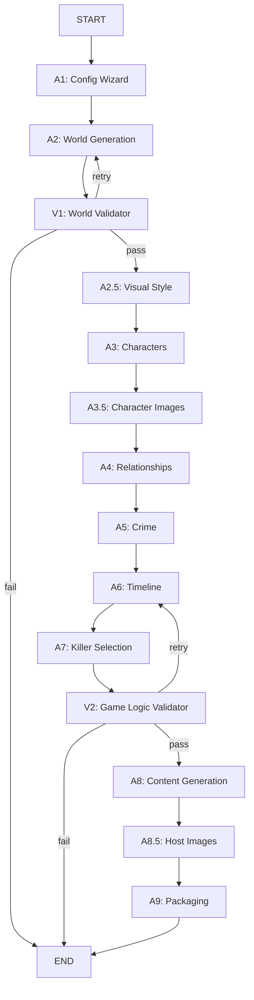

# Mystery Agents

AI-powered mystery party game generator using LangGraph and LangChain.

**Generate complete, playable murder mystery parties in minutes** — characters, clues, host guide, and everything ready to print!

📖 **[Read about the Game Experience](game_experience.md)** - See what playing a generated mystery is like

---

## Table of Contents

- [What is Mystery Agents?](#what-is-mystery-agents)
- [Quick Start](#quick-start)
- [Key Features](#key-features)
- [Usage Guide](#usage-guide)
  - [Basic Usage](#basic-usage)
  - [Configuration Options](#configuration-options)
  - [Character Image Generation](#character-image-generation)
- [What You Get](#what-you-get)
- [Technical Details](#technical-details)
  - [Architecture](#architecture)
  - [Project Structure](#project-structure)
  - [Development](#development)
- [AI Tools Disclaimer](#-ai-tools-disclaimer)
- [License](#license)

---

## What is Mystery Agents?

Mystery Agents generates **complete murder mystery party games** in the style of Cluedo and Knives Out. Give it your preferences (theme, era, language, number of players), and it creates:

- 🎭 **Unique characters** with secrets, motives, and backstories
- 🕵️ **A solvable mystery** with timeline, clues, and red herrings
- 📦 **Print-ready materials** (character sheets, host guide, clues)
- 🎨 **AI-generated portraits** for each character (optional)
- 🌍 **Cultural adaptation** - names and customs match your country/region
- 🗣️ **Native language generation** - Spanish or English (more coming)

**Perfect for:**
- Game masters planning a mystery party
- Writers exploring murder mystery structures
- Anyone who wants to host an interactive Cluedo-style event

---

## Quick Start

### 1. Prerequisites

- **Python 3.12+**
- **uv** package manager ([install here](https://github.com/astral-sh/uv))
- **PDF dependencies** (WeasyPrint):
  ```bash
  # Ubuntu/Debian
  sudo apt-get install -y libpango-1.0-0 libpangoft2-1.0-0 libgdk-pixbuf2.0-0 libffi-dev libcairo2
  
  # Fedora
  sudo dnf install pango gdk-pixbuf2 cairo
  
  # macOS
  brew install pango gdk-pixbuf cairo
  export DYLD_LIBRARY_PATH="/opt/homebrew/lib:$DYLD_LIBRARY_PATH"
  ```

### 2. Install

```bash
git clone https://github.com/juanje/mystery-agents.git
cd mystery-agents
uv sync
```

### 3. Configure API Key

Get a free API key from [Google AI Studio](https://aistudio.google.com/apikey), then:

```bash
# Option 1: Create .env file (recommended)
cp env.example .env
nano .env  # Add: GOOGLE_API_KEY=your-key-here

# Option 2: Environment variable
export GOOGLE_API_KEY='your-key-here'
```

### 4. Generate Your First Game

```bash
# Interactive wizard (recommended for first time)
uv run mystery-agents

# Or test without API calls
uv run mystery-agents --dry-run
```

**Done!** Your game package is in `output/mystery_game_xxxxx.zip` 🎉

---

## Key Features

### Core Capabilities

- ✅ **Complete Game Generation** - All materials for a live-action mystery party
- ✅ **Host-Detective Mode** - Host plays victim in Act 1, detective in Act 2
- ✅ **Act 1 Objectives** - Each player gets 2-3 goals creating social tension
- ✅ **Automatic Validation** - Two-stage validation with retry loops
- ✅ **Print-Ready PDFs** - Professional PDFs ready to print (markdown source optional with `--keep-work-dir`)

### Customization

- 🎨 **Themes**: Family mansion, corporate retreat, cruise ship, train, or custom
- 📅 **Eras**: Modern, 1920s, Victorian, or custom period
- 🌍 **Cultural Adaptation**: Character names, customs, settings match your country/region
- 👥 **Flexible Players**: 4-10 players, customizable gender distribution
- 🗣️ **Languages**: Spanish, English (native generation, not translation)

### AI Features

- 🖼️ **Character Portraits** - AI-generated images with consistent visual style
- 🎯 **Visual Style Guide** - Unified aesthetic (color palette, lighting, no text overlays)
- 🔄 **Parallel Generation** - Fast image creation with rate limiting
- 🤖 **Google Gemini Integration** - gemini-2.5-pro for generation, gemini-2.5-flash for validation

---

## Usage Guide

### Basic Usage

**Interactive Wizard** (recommended):
```bash
# Step-by-step configuration
uv run mystery-agents

# Skip image generation (faster, no API costs)
uv run mystery-agents --no-images

# Test without API calls (uses mock data)
uv run mystery-agents --dry-run
```

**Configuration File** (for repeated use):
```bash
# 1. Create config file
cp config.example.yaml config.yaml
nano config.yaml

# 2. Generate with config
uv run mystery-agents --config config.yaml
```

**Example config.yaml:**
```yaml
language: es              # es or en
country: Spain
region: Andalucía         # Optional
epoch: modern             # modern, 1920s, victorian, custom
theme: family_mansion     # family_mansion, corporate_retreat, cruise, train, custom
players:
  male: 3
  female: 3
host_gender: male
duration_minutes: 90      # 60-180
difficulty: medium        # easy, medium, hard
```

### Configuration Options

**CLI Flags:**
```bash
--config FILE         # Load configuration from YAML file
--dry-run            # Use mock data (no API calls)
--debug              # Enable debug logging
--no-images          # Skip character portrait generation
--keep-work-dir      # Keep intermediate markdown files
--output-dir DIR     # Custom output directory
```

**Environment Variables:**

Create a `.env` file (or set environment variables):
```bash
# Required
GOOGLE_API_KEY=your-api-key-here

# Optional: Override LLM models per tier
LLM_MODEL_TIER1=gemini-2.5-pro       # Logic/creativity
LLM_MODEL_TIER2=gemini-2.5-pro       # Content generation
LLM_MODEL_TIER3=gemini-2.5-flash     # Validation

# Optional: Override temperatures
LLM_TEMPERATURE_TIER1=0.6
LLM_TEMPERATURE_TIER2=0.7
LLM_TEMPERATURE_TIER3=0.3
```

See `env.example` for full configuration options.

### Character Image Generation

**Enabled by default.** Uses Google's Gemini 2.5 Flash Image model.

**Features:**
- ✅ Photorealistic portraits coherent with game world
- ✅ Visual style consistency (unified color palette, lighting)
- ✅ Period-appropriate styling (1920s, Victorian, Modern)
- ✅ No text/labels in images
- ✅ Parallel generation (~1-2 minutes for 6-8 characters)
- ✅ Embedded in PDFs, saved separately

**Cost & Performance:**
- Model: `gemini-2.5-flash-image` (cost-effective)
- Typical game: 6-8 images in ~1-2 minutes
- **Note**: Image generation incurs API costs. Use `--no-images` to skip.

```bash
# With images (default)
uv run mystery-agents

# Without images (no cost, faster)
uv run mystery-agents --no-images
```

📚 **Details**: [`docs/IMAGE_GENERATION.md`](docs/IMAGE_GENERATION.md)

---

## What You Get

### Output Structure

```
output/game_xxxxx/
├── mystery_game_xxxxx.zip       # Complete package (PDFs only)
│
├── /game/                       # Host materials (⚠️ SPOILERS!)
│   ├── host_guide.pdf           # Complete instructions
│   ├── solution.pdf             # The answer
│   └── clue_reference.pdf       # All clues with metadata
│
├── /characters/                 # Player packages
│   ├── Name_character_sheet.pdf    # Character + objectives
│   ├── Name_invitation.pdf         # Player invitation
│   ├── victim_character_sheet.pdf  # Host's Act 1 role
│   ├── detective_character_sheet.pdf  # Host's Act 2 role
│   └── ...
│
└── /clues/                      # Act 2 clues (no spoilers)
    ├── clue_01.pdf
    ├── clue_02.pdf
    └── ...
```

### Key Features

- 📄 **PDF-Only Package** - Everything print-ready, no clutter
- 📁 **Flat Structure** - All files easy to access
- 🏷️ **Clear Naming** - `Name_character_sheet.pdf`, `clue_01.pdf`
- 🖼️ **Embedded Images** - Portraits in PDFs, images separate
- 🌐 **Native Language** - Generated in target language (not translated)
- 🎨 **Professional Styling** - Beautiful PDFs via WeasyPrint
- 📦 **Complete ZIP** - Ready to share and print

### Optional: Intermediate Files

**By default**, only PDFs are kept in the final package. Markdown files are generated internally but deleted after PDF conversion.

Use `--keep-work-dir` to preserve intermediate files for inspection:
```
output/
├── game_xxxxx/          # Final PDFs (default output)
└── _work_xxxxx/         # Markdown sources + images (with --keep-work-dir)
```

---

## Technical Details

### Architecture

Mystery Agents uses **LangGraph** for workflow orchestration with **conditional validation loops**:

#### Workflow Graph



#### Agent Pipeline

1. **A1: Config Wizard** - Collects user preferences
2. **A2: World Generation** - Creates setting and atmosphere
3. **V1: World Validator** - Validates coherence (retries up to 2x)
4. **A2.5: Visual Style** - Generates unified visual style guide
5. **A3: Characters** - Creates suspects with secrets and objectives
6. **A3.5: Character Images** - (Optional) Generates AI portraits
7. **A4: Relationships** - Defines character connections
8. **A5: Crime** - Specifies victim, method, scene
9. **A6: Timeline** - Creates event sequence
10. **A7: Killer Selection** - Chooses culprit and finalizes solution
11. **V2: Game Logic Validator** - Validates consistency (retries up to 3x)
12. **A8: Content Generation** - Creates all game materials
13. **A8.5: Host Images** - (Optional) Generates victim/detective portraits
14. **A9: Packaging** - Generates PDFs and ZIP package

**Validation Loops:**
- **V1 (World)**: Retries up to 2 times → returns to A2
- **V2 (Game Logic)**: Retries up to 3 times → returns to A6

### Project Structure

```
mystery-agents/
├── src/mystery_agents/
│   ├── models/         # Pydantic state models
│   ├── agents/         # Agent implementations (A1-A9, V1-V2)
│   ├── graph/          # LangGraph workflow
│   ├── utils/          # Prompt templates and helpers
│   ├── config.py       # LLM configuration
│   └── cli.py          # CLI entry point
├── tests/
│   ├── unit/           # Unit tests
│   └── integration/    # Integration tests
├── docs/               # Documentation
├── output/             # Generated games (gitignored)
└── env.example         # Environment variables template
```

### Development

**Setup:**
```bash
# Install with dev dependencies
uv sync --all-extras
```

**Quality Checks:**
```bash
# Linting
uv run ruff check . --fix
uv run ruff format .

# Type checking
uv run mypy src/

# Tests (195 tests)
uv run pytest

# All checks
uv run ruff check . --fix && uv run ruff format . && uv run mypy src/ && uv run pytest
```

**Tech Stack:**
- **Python 3.12+** with type annotations
- **LangGraph** - Multi-agent workflow orchestration
- **LangChain** - LLM abstraction and tools
- **Google Gemini** - Text and image generation
- **Pydantic v2** - Data validation and modeling
- **WeasyPrint** - PDF generation from HTML/Markdown
- **Click** - CLI framework
- **pytest** - Testing framework

---

## 🤖 AI Tools Disclaimer

<details>
<summary>This project was developed with the assistance of artificial intelligence tools</summary>

**Tools used:**
- **Cursor**: Code editor with AI capabilities
- **Claude-Sonnet-4**: Anthropic's language model (claude-sonnet-4-20250514)

**Division of responsibilities:**

**AI (Cursor + Claude-Sonnet-4)**:
- 🔧 Initial code prototyping
- 📝 Generation of examples and test cases
- 🐛 Assistance in debugging and error resolution
- 📚 Documentation and comments writing
- 💡 Technical implementation suggestions

**Human (Juanje Ojeda)**:
- 🎯 Specification of objectives and requirements
- 🔍 Critical review of code and documentation
- 💬 Iterative feedback and solution refinement
- ✅ Final validation of concepts and approaches

**Collaboration philosophy**: AI tools served as a highly capable technical assistant, while all design decisions, educational objectives, and project directions were defined and validated by the human.
</details>

---

## License

MIT

## Author

- **Juanje Ojeda**
- Email: juanje.ojeda@gmail.com
- GitHub: <https://github.com/juanje/mystery-agents>
