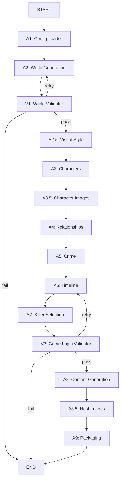

# Developer Guide

This guide explains the architecture, design decisions, and key patterns used in Mystery Agents. If you're planning to contribute or understand how the system works internally, start here.

---

## Table of Contents

1. [Architecture Overview](#architecture-overview)
2. [Agent System](#agent-system)
3. [State Management](#state-management)
4. [Configuration System](#configuration-system)
5. [Validation & Retry Loops](#validation--retry-loops)
6. [Caching Strategy](#caching-strategy)
7. [LLM Integration](#llm-integration)
8. [Image Generation](#image-generation)
9. [Parallel & Batch Operations](#parallel--batch-operations)
10. [Internationalization (i18n)](#internationalization-i18n)
11. [Logging System](#logging-system)
12. [Testing Strategy](#testing-strategy)

---

## Architecture Overview

### High-Level Design

Mystery Agents uses a **pipeline architecture** built on LangGraph with conditional validation loops.

**Key Principles:**
- **Sequential pipeline**: Each agent builds on previous work
- **Validation loops**: Two retry mechanisms (V1 for world coherence, V2 for game logic)
- **Immutable state flow**: Each agent receives state, returns modified state
- **Fail-fast**: Critical errors stop the pipeline, minor issues get retried

### Pipeline Flow

```
Config (YAML)
    ↓
┌───────────────────────────────────────────────────────┐
│ PHASE 1: World Setup                                  │
├───────────────────────────────────────────────────────┤
│  A1: Config Loader                                    │
│  A2: World Generation                                 │
│  V1: World Validator ──┐                              │
│    ├─ pass → continue  │  (World Retry Loop)          │
│    └─ fail → retry A2 ─┘  (max 2 retries)            │
│  A2.5: Visual Style                                   │
└───────────────────────────────────────────────────────┘
    ↓
┌───────────────────────────────────────────────────────┐
│ PHASE 2: Characters & Relationships                   │
├───────────────────────────────────────────────────────┤
│  A3: Characters                                       │
│  A3.5: Character Images (optional, parallel)          │
│  A4: Relationships                                    │
└───────────────────────────────────────────────────────┘
    ↓
┌───────────────────────────────────────────────────────┐
│ PHASE 3: Crime & Logic                                │
├───────────────────────────────────────────────────────┤
│  A5: Crime                                            │
│  A6: Timeline                                         │
│  A7: Killer Selection                                 │
│  V2: Game Logic Validator ──┐                         │
│    ├─ pass → continue        │  (Logic Retry Loop)    │
│    └─ fail → retry A6 ───────┘  (max 3 retries)      │
└───────────────────────────────────────────────────────┘
    ↓
┌───────────────────────────────────────────────────────┐
│ PHASE 4: Content & Packaging                          │
├───────────────────────────────────────────────────────┤
│  A8: Content Generation                               │
│  A8.5: Host Images (optional, parallel)               │
│  A9: Packaging (PDF + ZIP, parallel)                  │
└───────────────────────────────────────────────────────┘
    ↓
Final Output (ZIP)
```

### Workflow Graph (Mermaid)

For a visual representation:



### Directory Structure

```
src/mystery_agents/
├── agents/              # Pipeline agents (A1-A9, V1-V2)
│   ├── a1_config.py    # Config loader
│   ├── a2_world.py     # World generation
│   ├── v1_world_validator.py
│   ├── a3_characters.py
│   ├── a3_5_character_images.py
│   ├── a9_packaging.py # PDF generation & ZIP
│   └── ...
├── graph/              # LangGraph workflow
│   └── workflow.py     # Pipeline definition & routing
├── models/             # Pydantic models
│   ├── state.py        # GameState, GameConfig
│   └── game_models.py  # World, Character, Crime, etc.
├── utils/              # Shared utilities
│   ├── cache.py        # LLM & agent caching
│   ├── logging_config.py
│   ├── i18n.py         # Translation system
│   └── image_generation.py
└── cli.py              # CLI entry point
```

---

## Agent System

### Agent Pattern

All agents follow a consistent pattern:

```python
class ExampleAgent(BaseAgent):
    """Agent description."""
    
    def __init__(self):
        # Use cached LLM from AgentFactory
        llm = LLMCache.get_model("tier1")  # tier1, tier2, or tier3
        super().__init__(
            llm=llm,
            system_prompt=self._get_system_prompt(),
            response_format=ExpectedOutput,  # Pydantic model
        )
    
    def _get_system_prompt(self) -> str:
        """Static system prompt (can use templates)."""
        return "You are an AI that..."
    
    def run(self, state: GameState) -> GameState:
        """Main entry point - modifies and returns state."""
        log = AgentLogger(__name__, state)
        
        # Mock mode for testing
        if state.config.dry_run:
            log.info("Using mock data")
            return self._mock_output(state)
        
        # Build user message from state
        user_message = self._build_user_message(state)
        
        # Call LLM (structured output via BaseAgent)
        result = self.invoke(user_message, state.config)
        
        # Update state
        state.some_field = result.some_value
        log.info("✓ Agent completed")
        
        return state
    
    def _mock_output(self, state: GameState) -> GameState:
        """Mock data for --dry-run mode."""
        state.some_field = "mock_value"
        return state
```

### Agent Lifecycle

1. **Creation**: Agents are created once and cached by `AgentFactory`
2. **Invocation**: Workflow calls `agent.run(state)` in each node
3. **Reuse**: Same agent instance is reused in retry loops
4. **Stateless**: Agents don't maintain internal state (everything in GameState)

### Why This Pattern?

- **Testability**: Easy to test agents in isolation
- **Dry-run mode**: All agents support mock data for testing
- **Consistent API**: Every agent has `run(state) -> state`
- **Structured output**: Pydantic models ensure type safety
- **Reusability**: Agents are cached and reused efficiently

---

## State Management

### GameState Structure

The entire game generation is captured in `GameState`:

```python
@dataclass
class GameState:
    meta: MetaInfo                    # Game ID, timestamps
    config: GameConfig                # User configuration
    world: World | None = None        # A2 output
    visual_style: VisualStyle | None  # A2.5 output
    characters: list[Character]       # A3 output
    crime: Crime | None               # A5 output
    timeline: Timeline | None         # A6 output
    killer_id: str | None             # A7 output
    content: GameContent | None       # A8 output
    packaging: PackagingResult | None # A9 output
    
    # Validation state
    world_validation: WorldValidation | None
    validation: ValidationResult | None
    world_retry_count: int = 0
    retry_count: int = 0
```

### Design Decisions

**Why a single large state object?**
- LangGraph requires state to flow through nodes
- All agents need access to previous outputs
- Easy to serialize/debug entire game state
- Type-safe with Pydantic validation

**Why optional fields?**
- State is built incrementally through the pipeline
- Early agents populate fields for later agents
- Validation can check if required fields exist

**Why separate validation state?**
- Retry loops need to track attempt counts
- Validation results inform routing decisions
- Keeps domain models clean

---

## Configuration System

### Two-Level Configuration

**1. User Configuration (YAML → GameConfig)**
```yaml
# game.yml - User defines game parameters
language: es
country: Spain
epoch: modern
theme: family_mansion
players:
  male: 3
  female: 3
```

**2. System Constants (`utils/constants.py`)**
```python
# Developer-defined system defaults
DEFAULT_RECURSION_LIMIT = 50
IMAGE_GENERATION_MODEL = "models/gemini-2.5-flash-image"
LLM_MODEL_TIER1 = "gemini-2.5-pro"
LLM_MODEL_TIER2 = "gemini-2.5-pro"
LLM_MODEL_TIER3 = "gemini-2.5-flash"
IMAGE_GENERATION_MAX_CONCURRENT = 5
```

### Why This Split?

- **User config**: Game-specific settings (what to generate)
- **System constants**: Technical settings (how to generate)
- **Separation of concerns**: Users don't need to know about models or limits
- **Type safety**: GameConfig uses Pydantic, constants are simple Python values

### Environment Variables

```bash
# .env file
GOOGLE_API_KEY=xxx           # Required
LLM_MODEL_TIER1=gemini-2.5-pro    # Optional override
LLM_MODEL_TIER2=gemini-2.5-pro
LLM_MODEL_TIER3=gemini-2.5-flash
```

Loaded via `python-dotenv` in `cli.py`, accessed via `os.getenv()` in `llm_config.py`.

---

## Validation & Retry Loops

### Two Validation Points

**V1: World Validation (after A2)**
```python
def should_retry_world_validation(state: dict) -> str:
    """Route back to A2 if world validation fails."""
    validation = state.get("world_validation")
    retry_count = state.get("world_retry_count", 0)
    max_retries = state.get("max_world_retries", 2)  # Default: 2
    
    if validation and not validation.is_coherent:
        if retry_count < max_retries:
            return "retry_world"  # Go back to A2
    
    return "continue"  # Proceed to A2.5
```

**V2: Game Logic Validation (after A7)**
```python
def should_retry_validation(state: dict) -> str:
    """Route back to A6 if game logic is inconsistent."""
    validation = state.get("validation")
    retry_count = state.get("retry_count", 0)
    max_retries = state.get("max_retries", 3)  # Default: 3
    
    if validation and not validation.is_consistent:
        if retry_count < max_retries:
            return "retry"  # Go back to A6
    
    return "continue"  # Proceed to A8
```

### Why Two Loops?

- **World validation**: Catches location/setting issues early
- **Logic validation**: Ensures killer logic, timeline, clues are consistent
- **Performance**: Fix issues before generating expensive content
- **Max retries**: Prevents infinite loops (2 for world, 3 for logic)

### What Gets Validated?

**V1 (World)**:
- Location coherence (rooms make sense for theme/epoch)
- Cultural consistency (names, customs match country/region)
- Historical accuracy (items, technology match epoch)

**V2 (Game Logic)**:
- Killer has motive, means, opportunity
- Timeline is consistent
- Clues lead to killer
- No plot holes or contradictions

---

## Caching Strategy

### Why Caching?

**Problem**: Without caching, a typical game creates:
- 30+ LLM instances (one per agent invocation)
- 17+ agent instances (especially in retry loops)
- 10-15 seconds of initialization overhead

**Solution**: Multi-level caching

### Level 1: LLM Cache

```python
from mystery_agents.utils.cache import LLMCache

# Instead of creating new instances
llm = LLMCache.get_model("tier1")  # Cached, reused
```

**Result**: Only 3 LLM instances total (tier1, tier2, tier3)

### Level 2: Agent Cache

```python
from mystery_agents.utils.cache import AgentFactory

# In workflow.py
agent = AgentFactory.get_agent(WorldAgent)  # Cached, reused in retries
```

**Result**: Only 11 agent instances (one per agent class)

### Performance Impact

- **~80% reduction** in LLM instance creation
- **~60% faster** initialization
- **Retry loops** don't slow down execution (agents are reused)
- **Reduced memory** footprint

### Usage in Code

**For agent developers:**
```python
class MyAgent(BaseAgent):
    def __init__(self):
        llm = LLMCache.get_model("tier2")  # Use this instead of LLMConfig
        super().__init__(llm=llm, ...)
```

**For workflow developers:**
```python
def my_node(state: GameState) -> GameState:
    agent = AgentFactory.get_agent(MyAgent)  # Use this instead of MyAgent()
    return agent.run(state)
```

---

## LLM Integration

### Three-Tier System

We use **tiered LLMs** based on task complexity:

| Tier | Default Model | Use Case | Examples |
|------|--------------|----------|----------|
| **Tier 1** | gemini-2.5-pro | Complex reasoning | World gen, style guide |
| **Tier 2** | gemini-2.5-pro | Content generation | Characters, crime, clues |
| **Tier 3** | gemini-2.5-flash | Validation, quick tasks | V1, V2, translation |

### Why Tiered?

- **Cost optimization**: Use faster/cheaper models where possible
- **Performance**: Tier3 for quick validation checks
- **Flexibility**: Easy to upgrade specific tiers
- **Override**: Set via environment variables

### Structured Output

All agents use Pydantic models for LLM responses:

```python
class WorldOutput(BaseModel):
    location_name: str
    location_type: str
    rooms: list[Room]
    epoch_description: str

# In agent
result = self.invoke(user_message, state.config)
# result is type-safe WorldOutput, not raw text
```

**Benefits**:
- Type safety
- Automatic validation
- No parsing errors
- Self-documenting API

### Debug Middleware

The `--debug` flag logs LLM responses:

```python
# In BaseAgent.invoke()
if config.debug_model:
    logger.info(f"[DEBUG] LLM Response: {response.content}")
```

**Use cases**:
- Debugging prompt engineering
- Understanding validation failures
- Improving mock data quality

---

## Image Generation

### Implementation

Uses **Gemini 2.5 Flash Image** via LangChain:

```python
# utils/image_generation.py
llm = ChatGoogleGenerativeAI(
    model="gemini-2.5-flash-image",
    temperature=0.6,
)

message = HumanMessage(content=[{"type": "text", "text": prompt}])

resp = llm.invoke(
    [message],
    generation_config={"response_modalities": ["IMAGE"]}
)

# Extract base64 image and save
```

### Async + Retry Logic

```python
async def generate_image_with_gemini(
    prompt: str,
    output_path: Path,
    max_retries: int = 3,
    retry_delay_base: float = 2.0,
) -> bool:
    for attempt in range(max_retries):
        try:
            await _call_gemini_image_api(prompt, output_path)
            return True
        except Exception:
            if attempt < max_retries - 1:
                delay = retry_delay_base * (2**attempt)
                await asyncio.sleep(delay)
    return False
```

**Why this approach?**
- **Exponential backoff**: Handles rate limits gracefully
- **Async**: Non-blocking for parallel generation
- **Retry logic**: Recovers from transient failures
- **Returns bool**: Workflow continues even if images fail

### Prompt Engineering

Images use detailed prompts with:
- Character name, age, gender, role
- Personality traits
- Historical period (1920s, Victorian, etc.)
- Cultural context (Spain, England, etc.)
- Visual style requirements (photorealistic, period-appropriate)
- Negative prompts (no text, no watermarks)

---

## Parallel & Batch Operations

### Image Generation (A3.5)

```python
async def _generate_all_images_async(
    self,
    image_tasks: list[tuple],
    semaphore: asyncio.Semaphore,
) -> list[str]:
    """Generate images in parallel with rate limiting."""
    tasks = [
        self._generate_single_image(character, prompt, semaphore)
        for character, prompt in image_tasks
    ]
    return await asyncio.gather(*tasks, return_exceptions=True)
```

**Key patterns**:
- **Semaphore**: Limits concurrent API calls (default: 5)
- **asyncio.gather**: Runs all tasks in parallel
- **return_exceptions=True**: Doesn't fail entire batch on one error

### PDF Generation (A9)

```python
with ProcessPoolExecutor(max_workers=12) as executor:
    futures = [
        executor.submit(_generate_pdf_worker, task)
        for task in pdf_tasks
    ]
    for future in futures:
        result = future.result(timeout=30)
```

**Key patterns**:
- **ProcessPoolExecutor**: True parallelism (bypasses GIL)
- **Worker function**: Must be module-level for pickling
- **Timeout**: Prevents hanging on bad PDFs
- **Progress reporting**: Shows user what's happening

### Why Different Approaches?

- **Images**: Async I/O (waiting on API), use asyncio
- **PDFs**: CPU-bound (WeasyPrint rendering), use processes
- **Trade-off**: Processes have overhead, but PDFs are CPU-intensive

---

## Internationalization (i18n)

### Architecture

```
TranslationManager (Singleton)
  ├── locales/en.json  # Source language
  ├── locales/es.json  # Spanish
  └── locales/...      # Future languages
```

### Usage

```python
from mystery_agents.utils.i18n import TranslationManager

tm = TranslationManager(language="es")

# Simple key
label = tm.get("documents.character_sheet")  # "Hoja de Personaje"

# With variables
text = tm.get("welcome.message", {"name": "Elena"})  # "Bienvenida, Elena"

# Get entire section
labels = tm.get_section("documents")
# Returns: {"character_sheet": "...", "host_guide": "..."}
```

### Design Decisions

**Why JSON instead of .po/.pot files?**
- Simpler for developers (no special tools needed)
- Easy to validate structure
- Built-in Python support
- Can nest keys for organization

**Why singleton?**
- Translation files loaded once
- Cached for performance
- Consistent across entire app

**Why no gettext?**
- LLMs generate content in target language natively (not translated)
- Only UI labels/document titles need i18n
- JSON is sufficient for this use case

### Language Injection Pattern

For non-English games, we inject special instructions into LLM prompts:

```python
def _get_language_injection(language: str) -> str:
    if language == "en":
        return ""
    
    return f"""
CRITICAL: Generate ALL content in {language}.
- Character names must be culturally appropriate for {language}
- Dialogue, clues, descriptions: ALL in {language}
- Maintain JSON structure but content in {language}
"""
```

**Why injection vs translation?**
- Native generation is better than translation
- Preserves cultural context
- More natural language
- Cheaper (one LLM call instead of two)

---

## Logging System

### Architecture

```python
AgentLogger (Wrapper)
  ├── Default mode: click.echo() for visual progress
  ├── -v mode: logging.info() with timestamps
  ├── -vv mode: logging.debug() with cache details
  └── --log-file: Always writes INFO+ to file
```

### Usage in Agents

```python
def run(self, state: GameState) -> GameState:
    log = AgentLogger(__name__, state)
    
    log.info("Generating world...")  # Adapts to verbosity mode
    log.debug("Using cached LLM")    # Only in -vv
    log.info("✓ World generated")
    
    return state
```

### Why AgentLogger?

- **Abstracts verbosity logic**: Agents don't need if/else for logging
- **Consistent formatting**: `[agent_name]` tags automatically
- **File logging**: Decoupled from console verbosity
- **Clean API**: `log.info()`, `log.debug()`, `log.error()`

### Verbosity Levels

| Level | Output | Use Case |
|-------|--------|----------|
| Default | Visual progress | User-friendly |
| `-v` | INFO logs + timestamps | Debugging, CI/CD |
| `-vv` | INFO + DEBUG logs | Deep debugging |
| `--quiet` | Config + result + errors | Automation |
| `--log-file` | Always INFO+ to file | Post-analysis |

### Design Decision: Why not just use Python logging everywhere?

- **User experience**: Default mode is cleaner without timestamps/levels
- **Best of both worlds**: Visual progress for users, structured logs for analysis
- **Log file independence**: Can have clean console + detailed file

---

## Testing Strategy

### Test Hierarchy

```
tests/
├── unit/                  # Fast, isolated tests
│   ├── test_agents.py    # Agent logic without LLM calls
│   ├── test_cache.py     # Caching behavior
│   ├── test_i18n.py      # Translation logic
│   └── test_validators.py
├── integration/          # Multi-component tests
│   ├── test_workflow.py  # Full pipeline in dry-run mode
│   ├── test_cli.py       # CLI argument parsing
│   └── test_agents_integration.py
└── conftest.py           # Shared fixtures
```

### Testing Agents

**Unit tests** (no LLM calls):
```python
def test_world_agent_mock_output():
    """Test agent logic without API calls."""
    agent = WorldAgent()
    state = GameState(config=GameConfig(dry_run=True, ...))
    
    result = agent.run(state)
    
    assert result.world is not None
    assert result.world.location_name
```

**Integration tests** (full pipeline):
```python
def test_workflow_dry_run():
    """Test entire workflow with mock data."""
    state = GameState(config=GameConfig(dry_run=True, ...))
    
    workflow = create_workflow()
    final_state = workflow.invoke(state)
    
    assert final_state["packaging"] is not None
```

### Mocking Strategy

**For LLM calls**:
- Use `dry_run=True` mode
- Each agent has `_mock_output()` method
- Tests run fast (no API calls)

**For external dependencies**:
```python
from unittest.mock import patch

@patch("mystery_agents.utils.image_generation.ChatGoogleGenerativeAI")
def test_image_generation(mock_llm):
    mock_llm.return_value.invoke.return_value = mock_response
    # Test image generation logic
```

### Test Coverage Goals

- **Unit tests**: 90%+ coverage of core logic
- **Integration tests**: All happy paths + validation loops
- **CLI tests**: All flags and error cases
- **I18n tests**: All languages have same keys

---

## Contributing

### Before You Start

1. Read this guide
2. Check `TODO.md` for planned work
3. Run tests: `uv run pytest`
4. Verify linting: `uv run ruff check .`

### Adding a New Agent

1. Create agent file: `src/mystery_agents/agents/aX_name.py`
2. Follow agent pattern (see Agent System section)
3. Add Pydantic model for output
4. Implement `_mock_output()` for testing
5. Add node to workflow: `src/mystery_agents/graph/workflow.py`
6. Write unit tests: `tests/unit/test_name.py`
7. Update `README.md` if user-facing

### Modifying the Pipeline

1. Update workflow graph: `src/mystery_agents/graph/workflow.py`
2. Update `GameState` if adding new fields
3. Add routing logic if needed
4. Update integration tests
5. Update architecture diagram in README

### Code Style

- **Language**: English (code, comments, docs)
- **Type hints**: All functions must have type annotations
- **Docstrings**: Google style for public APIs
- **Formatting**: `ruff format .`
- **Linting**: `ruff check . --fix`
- **Tests**: Required for new features

### Commit Messages

Follow conventional commits:
```bash
feat: add new agent for X
fix: resolve issue with Y
docs: update developer guide
test: add tests for Z
refactor: simplify cache logic
```

---

## Additional Resources

- **Main README**: User documentation and quick start
- **Code**: Most modules have detailed docstrings
- **Tests**: Unit tests serve as usage examples
- **Issues**: Check GitHub for known issues and discussions

---

## Questions?

If something is unclear or missing from this guide, please:
1. Open an issue on GitHub
2. Propose improvements via PR
3. Ask in discussions

This guide should evolve as the project grows!
